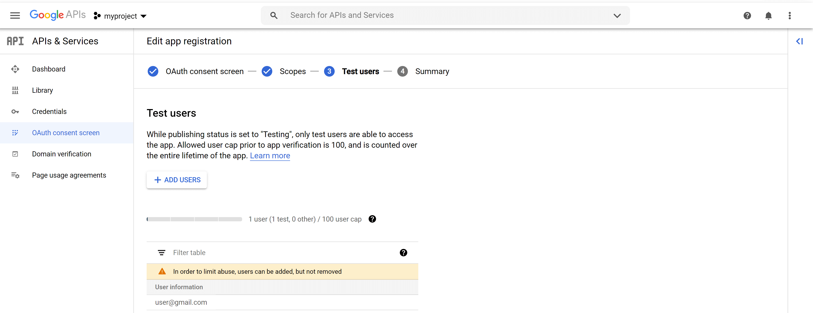

# Terraform Budget GCP

These modules create infrastructure on the Google Cloud Platform (GCP) that can be run for less than **10$** a month.( *[YMMV](https://nufailtd.github.io/budget-gcp/)* )
This repo contains instructions on how to actually create these resources.
Read the [companion article](https://nufailtd.github.io/budget-gcp/) to understand what choices were made to cut costs.

It guides on how to create all the resources plus pre-requisites from scratch.  
Resources created  include;

- A Domain Name using Freenom
- A GCP Organization
- A GCP Seed Project from which other projects will be created.
- A GCP Project for our resources.
- A GKE Private Cluster.
- A Google Container Instance running Traefik.
- A Google CloudRun Service running Vault.


## Compatibility

 This module is meant for use with Terraform 0.12. 

## Requirements
* A Domain Name.
* A Google Cloud Platform Account.
* A Valid Debit or Credit Card to enable billing.
---
## Setup
### Pre-Requisites
You need the following before you can proceed. Skip if you already have these.  
**1. Get a Domain Name**
<details>
  <summary>Click to expand</summary>
 
 #### Step 1  
1. Visit [https://www.freenom.com](https://www.freenom.com).  
2. Search for a domain you like and click **Check Availability.  

3. If the domain name is available click **Get it now!** and then click **Checkout. 
 
4. Set the period to 12 months. Then click **Continue**.  
5. Check **I have read and agree to the Terms & Conditions**. Then click **Complete Order**.  
6. Provide your email and set up a password.
 
7. You will receive an email notification to complete your order.
 
8. Click on the confirmation link in the email and and provide your information to complete registration.
 
9. You should be able to view your registered domain
 

 You **cannot** use cloudflare API if your domain is a 
`.cf, .ga, .gq, .ml, or .tk`  
**Skip** Steps 2 & 3 if you have any of these.

#### Step 2

1. Visit [https://dash.cloudflare.com/sign-up](https://dash.cloudflare.com/sign-up).
2. Click **Add a site** in Account Dashboard.
3. Type in the domain you created above and click **Add site**.
4. Select the Free Plan and click **Confirm plan**.
5. Cloudflare will scan for existing DNS records. Wait until it finishes, and click **Continue**.  
6. Cloudflare will give you two nameservers to set up in Freenom.
#### Step 3
1. Go back to Freenom, Click **Services** > **My Domains**. Click **Manage Domain** on the domain that you’re configuring.
 
2. Click **Management Tools** > **Nameservers** > **Use custom nameservers** (enter below). Now enter the nameservers provided by Cloudflare, and click **Change Nameservers**.
 
3. Go back to Cloudflare, click **Done**, **check nameservers**. It may take a while, you will receive an email once your domain has been added.
4. Click **Profile** > **API Tokens** > **Create Token**
5. On **Edit zone DNS**, Click **Use Template** > Under **Zone Resources** > Select your domain
6. Click **Continue To Summary** > **Create Token** then copy and save the created token.

#### [Reference](https://dev.to/hieplpvip/get-a-free-domain-with-freenom-and-cloudflare-k1j)
</details>

**2. Sign up for a GCP Account**
<details>
  <summary>Click to expand</summary>

1. Visit [Google Cloud](https://console.cloud.google.com/freetrial/signup) to create your account.  
Provide the required information and you should be greeted with this page.


</details>


---

<a href="https://ssh.cloud.google.com/cloudshell/editor?cloudshell_git_repo=https://github.com/nufailtd/terraform-budget-gcp&open_in_editor=README.md&cloudshell_tutorial=tutorial.md" target="_blank"></a>

You only need to click on this button once.  
If you already did this, [**click here**](https://ssh.cloud.google.com/cloudshell/editor?cloudshell_tutorial=cloudshell_open/terraform-budget-gcp/tutorial.md).  

---

### Create the GCP Seed Project
**Please skip** this for now and return when/if you successfully create an organization.  
We are able to deploy our resources without it. 
<details>
  <summary>Click to show</summary>

Switch to the `seed_project` folder;  
```
cd ~/cloudshell_open/terraform-budget-gcp/seed_project
```

Create a file `terraform.tfvars` with the following information from the organization you just created;

```
org_id                  = "<ORGANIZATION_ID>"

billing_account         = "<BILLING_ACCOUNT_ID>"

group_org_admins        = "<admin@domain.com>"

group_billing_admins    = "<billing@domain.com>"

default_region          = "us-central1"

sa_enable_impersonation = true
```


Then perform the following commands:

- `terraform init` - to get the plugins
```
you@cloudshell:~/cloudshell_open/terraform-budget-gcp/seed_project$ terraform init
```
- `terraform plan` - to see the infrastructure plan
```
you@cloudshell:~/cloudshell_open/terraform-budget-gcp/seed_project$ terraform plan
```
 - `terraform apply --auto-approve` - to apply the infrastructure build
```
you@cloudshell:~/cloudshell_open/terraform-budget-gcp/seed_project$ terraform apply --auto-approve
```

</details>

---

### Create the GCP Project


Switch to the `budget_gcp_project` folder;  
```
cd ~/cloudshell_open/terraform-budget-gcp/budget_gcp_project
```

Create a `terraform.tfvars` file in the `budget_gcp_project` directory by running  
```
./create-tfvars.sh myproject
```
Example;
```
user@cloudshell:~/cloudshell_open/terraform-budget-gcp/budget_gcp_project$ ./create-tfvars.sh myproject

## This section has been auto-generated by ./create-tfvars.sh  ##
email           = "user@gmail.com"
billing_account = "02E280-9E2C47-1DF365"
name            = "myproject"
## This section has been auto-generated by ./create-tfvars.sh  ##
```

Then perform the following commands:

- `terraform init` - to get the plugins
```
you@cloudshell:~/cloudshell_open/terraform-budget-gcp/budget_gcp_project$ terraform init
```
- `terraform plan` - to see the infrastructure plan
```
you@cloudshell:~/cloudshell_open/terraform-budget-gcp/budget_gcp_project$ terraform plan
```
 - `terraform apply --auto-approve` - to apply the infrastructure build
```
you@cloudshell:~/cloudshell_open/terraform-budget-gcp/budget_gcp_project$ terraform apply --auto-approve
```

This operation will output the `project_id` to be used in the next steps.

Before creating our resources it will be convenient to complete the following manual operations.  
This will help us automate the final step.

<a name="create-oauth2-client"></a>
#### **Create an Oauth2 Client in GCP**
<details>
  <summary>Click to expand</summary>
  
1. Log in to your Google Cloud account and go to the [APIs & services](https://console.developers.google.com/projectselector/apis/credentials).

 Navigate to **Consent** using the left-hand menu and select **External**


2. Configure your **Oauth Consent Screen**  
Fill in "Application Name"  
Proceed to next page and under scopes make sure you select the following scopes **only**  
`openid, profile, email`  

Add your email as a test user and complete.

A successful configuration should like below


3. Create New Credentials.  
On the **Credentials** page, click **Create credentials** and choose **OAuth [Client ID]**.


4. Configure Client ID  
On the **Create [Client ID]** page, select **Web application**.   
Under **Authorized redirect URIs**
set the following parameters substituting `domain.com` for domain you created above  
`https://authenticate.domain.com/oauth2/callback`  
`https://vault.domain.com/ui/vault/auth/oidc/oidc/callback`  


5. Click **Create** to proceed. The [Client ID] and [Client Secret] settings will be displayed.  

Download the client_secret file to be used in a later configuration.


</details>


<a name="create-zone"></a>
#### **Create a zone in CloudDNS**
<details>
  <summary>Click to expand</summary>

  1. In your Google Cloud account go to [Net services](https://console.cloud.google.com/projectselector/net-services/dns/zones).

 Select the project created above then navigate to **Cloud DNS** using the left-hand menu and click **Create zone**


2. Create New Zone.  
On the **Create a DNS Zone** page, enter a **Zone Name** (a nice approach is to replace the periods in your domain with a dash) then enter the domain you created above in **DNS name**.


3. Get Nameservers.  
Nameservers in the format **ns-cloud-xx.googledomains.com** will be presented to you.  
 Take note of them as you will use them in the next step.


</details>

<a name="update-nameservers"></a>
#### **Update Nameservers in Freenom (Or your Domain Name Registrar)**
<details>
  <summary>Click to expand</summary>

1. Login to your Freenom account, Click **Services** > **My Domains**. Click **Manage Domain** on the domain that you’re configuring.
 
2. Click **Management Tools** > **Nameservers** > **Use custom nameservers** (enter below). Now enter the nameservers from CloudDNS, and click **Change Nameservers**.


 3. Confirm the nameservers have been set successfully.


</details>


---
### Create resources in the GCP Project
The variables for this step are derived from the previous steps, namely:
- `oauth2 ClientID`
- `oauth2 ClientSecret`
- `cloudflare Token` (optional)
- `domain`
- `project_id`


Make sure you are in the root folder  
```
cd ~/cloudshell_open/terraform-budget-gcp
```

Create a file `terraform.tfvars` by running the following command;
```
cp tfvars.example terraform.tfvars
```
In your cloud shell editor, open the file `terraform.tfvars` and change the values in `"<>"` to match your values from the previous steps.

```
project_id       = "<project_name>"
region           = "us-central1"
zones            = ["us-central1-a"]
cluster_name     = "kluster"
domain           = "<your domain>"
domain_filter    = "<your domain>"
run_post_install = false
email            = "<your email>"
dns_auth              = [
    {
      name = "provider"
      value = "google"
     }
  ]
# OIDC Configuration
oidc_config           = [
    {
      name = "authenticate.idp.provider"
      value = "google"
     },
    {
      name = "authenticate.idp.clientID"
      value = "<[project_id]-[hash].apps.googleusercontent.com>"
    },
    {
      name = "authenticate.idp.clientSecret"
      value = "<mysecret>"
    },
    {
      name  = "authenticate.idp.url"
      value = "https://accounts.google.com"
    }
  ]
```

Then perform the following commands:  

It is recommended to run this before performing the subsequent commands.  
This ensures that you use the project's service account to create resources. 
The token expires every hour so you'll have to re-issue these command if you get a **not allowed** error.  
Simply run;  
`. ./auth.sh [your_project_id]`;
```
 you@cloudshell:~/cloudshell_open/terraform-budget-gcp$ . ./auth.sh [your_project_id]
```

- `terraform init` - to get the plugins
```
you@cloudshell:~/cloudshell_open/terraform-budget-gcp$ terraform init
```
- `terraform plan` - to see the infrastructure plan
```
you@cloudshell:~/cloudshell_open/terraform-budget-gcp$ terraform plan
```
 - `terraform apply --auto-approve` - to apply the infrastructure build
```
you@cloudshell:~/cloudshell_open/terraform-budget-gcp$ terraform apply --auto-approve
```


**Important!!**
Once the above step completes successfully, perform the following command:
`./post-install.sh`

```
you@cloudshell:~/cloudshell_open/terraform-budget-gcp$ ./post-install.sh
```
- This will, in order, do the following;
  1. Set `run_post_install = true` in `terraform.tfvars`
  2. Enable `vault-config` module in file vault-config.tf
  3. Run `terraform init` to get plugins
  4. Run `terraform plan` to display proposed changes  

**Note:** It is possible to run these commands manually and skip the `./post-install.sh` script.  
This script just offers convenience.


Then run: 
 - `terraform apply --auto-approve` - to apply the infrastructure build
```
you@cloudshell:~/cloudshell_open/terraform-budget-gcp$ terraform apply --auto-approve
```
We do this in 2 steps because of some limitations in terraform that will cause an error if certain resources do not exist.

If you encounter any errors, try re-running the command  
`terraform apply --auto-approve`.  
It is safe to do so.

#### Sucesss 

Congratulations!! You did it.  
Some of the services automatically deployed can be found in the following urls (substituting **your.domain** of course);  
1. **Vault**   https://vault.your.domain  
2. **Pomerium** https://authenticate.your.domain/.pomerium/  
3. **Traefik** https://dash.your.domain  
4. **Ghost** https://blog.your.domain  

Check them out below


#### File structure
The project has the following folders and files:
```
- /: root folder
- /modules/cert/: - creates certificated for our domain.
- /modules/cloud-run/: creates a ghost blog cloudrun service
- /modules/custom-nat/: creates an internet gateway for our private cluster
- /modules/dns/: creates domain records for our domain name
- /modules/kubeip/: assigns a static IP to instances in our cluster *not used*
- /modules/pomerium-app/: secures our applications to provide access to from allowed users only
- /modules/test-workload-identity/: tests the google workload identity feature
- /modules/traefik-sa/: creates a kubernetes service account used by traefik-vm
- /modules/traefik-vm/: creates an instance with a public ip to route traffic to our cluster
- /modules/vault-cloud-run/: creates a vault application running in cloudrun
- /modules/vault-sa/: creates a kubernetes service account to be used by the vault application
- /modules/workload-identity/: allows us to access google apis without requiring us to save key files
- /tfvars.example: an example of a file to generate terraform.tfvars
- /variables.tf: variables used by our main.tf file
- /main.tf/: creates gke cluster and the rest of the modules
- /outputs.tf: displays created resources
- /README.md: this file
- /auth.sh: authenticates your servicce account
- /post-install.sh: creates resources that could not be created in the first run
```
---

#### Acknowledgements
This project builds upon some excellent work from other projects. Here are some of them;


- [Sandeep Dinesh](https://github.com/thesandlord) - [Get 3X Capacity for your Kubernetes Cluster](https://medium.com/swlh/get-three-times-the-capacity-for-your-kubernetes-cluster-for-free-too-good-to-be-true-6f0c3032c296)
- [Niko Kosonen](https://github.com/nkoson) - [How to: Kubernetes for Cheap on Google Cloud](https://github.com/nkoson/gke-tutorial)
- [Henrik Hoegh](https://github.com/hoeghh) - [Proxying Kubernetes services with Traefik](https://www.praqma.com/stories/proxying-kubernetes/)
- [Ahmet B](https://github.com/ahmetb) - [Cloud Run Static IP](https://ahmet.im/blog/cloud-run-static-ip/)
- [Seth Vargo](https://github.com/sethvargo) - [Vault Init](https://github.com/sethvargo/vault-init/)
- [Mike Brancato](https://github.com/mbrancato) - [Vault Google Cloud Run Module](https://github.com/mbrancato/terraform-google-vault)

#### Clean up
You now have GCP resources to play around with on the cheap.
However, if you want to delete these resources and stop charges accruing to your account, run

- `terraform destroy --auto-approve` to destroy the built infrastructure
